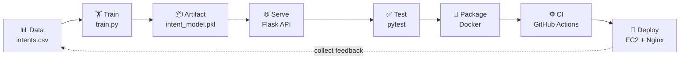
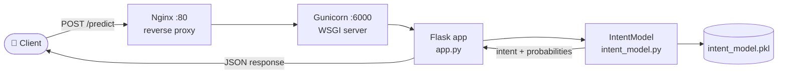
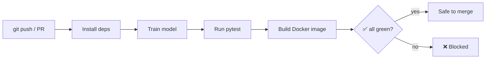
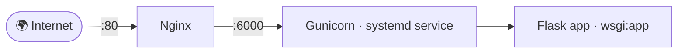

# 🧠 Intent Classifier — A Hands-On MLops Template

> Take a tiny machine-learning model **all the way from a CSV file to a production server** — and learn the full MLops lifecycle, one stage at a time.


📚 Part of the [MLops learning curriculum](../README.md) · **Module 5 of 5** — serving & deployment

This repository is intentionally **small** so you can read *all* of it, and intentionally **complete** so you see *every* moving part of a real ML deployment. It is built to be used as a **learning template**: clone it, follow the 6 stages below, and by the end you will have trained a model, served it over HTTP, tested it, containerised it, set up CI, and deployed it to a server.

---

## 📚 Table of Contents

- [What you'll learn](#-what-youll-learn)
- [The MLops lifecycle](#-the-mlops-lifecycle)
- [Architecture](#-architecture)
- [Repository layout](#-repository-layout)
- [Quick start (5 minutes)](#-quick-start-5-minutes)
- [The 6 learning stages](#-the-6-learning-stages)
- [API reference](#-api-reference)
- [Common commands (Makefile)](#-common-commands-makefile)
- [Troubleshooting](#-troubleshooting)
- [Where to go next](#-where-to-go-next)
- [Credits](#-credits)

---

## 🎯 What you'll learn

MLops is the practice of **getting machine-learning models into production reliably and repeatably**. This template teaches the core skills:

| Skill | Where you practice it |
| --- | --- |
| Separating **data** from **code** | `data/intents.csv` + `model/train.py` |
| Training & saving a **model artifact** | `model/train.py` → `model/artifacts/intent_model.pkl` |
| **Serving** a model behind an API | `app.py`, `model/intent_model.py` |
| Writing **tests** for ML code | `tests/` |
| **Containerising** with Docker | `Dockerfile`, `.dockerignore` |
| **CI** (automated build + test) | `.github/workflows/ci.yml` |
| **Deploying** to a server | `userdata.sh` (Nginx + Gunicorn + systemd) |

The model itself is deliberately trivial — a Naive Bayes classifier that labels a sentence as `greeting`, `question`, `complaint`, or `praise`. The point is not the model; **the point is everything around it.**

---

## 🔄 The MLops lifecycle

Each stage in this repo maps to a step in the real MLops loop:



---

## 🏗️ Architecture

How a request flows through the deployed system:



The layered design is on purpose: the **API never imports scikit-learn directly**. It only talks to `IntentModel`, so you could swap Naive Bayes for a deep-learning model without touching `app.py`.

---

## 📁 Repository layout

```
Intent-classifier-model/
├── data/
│   └── intents.csv          # 📊 Training data (kept OUT of the code)
├── model/
│   ├── train.py             # 🏋️ Stage 1: train + save the artifact
│   ├── intent_model.py      # 📦 Loads the artifact, exposes predict()
│   └── artifacts/           #    intent_model.pkl lands here (git-ignored)
├── tests/
│   ├── test_model.py        # ✅ Stage 3: model tests
│   └── test_app.py          #    API tests (Flask test client)
├── app.py                   # 🌐 Stage 2: Flask API (/health, /predict)
├── wsgi.py                  #    Production entrypoint for Gunicorn
├── Dockerfile               # 🐳 Stage 4: container image
├── .dockerignore
├── .github/workflows/ci.yml # ⚙️ Stage 5: CI pipeline
├── userdata.sh              # 🚀 Stage 6: EC2 provisioning script
├── Makefile                 #    Handy shortcuts (make help)
├── requirements.txt
└── docs/LEARNING_PATH.md    # 📖 Detailed, exercise-driven walkthrough
```

---

## ⚡ Quick start (5 minutes)

```bash
# 1. Clone
git clone https://github.com/Parsa8304/Intent-classifier-model.git
cd Intent-classifier-model

# 2. Create a virtualenv and install dependencies
python3 -m venv .venv
source .venv/bin/activate          # Windows: .venv\Scripts\activate
pip install -r requirements.txt

# 3. Train the model (creates model/artifacts/intent_model.pkl)
python model/train.py

# 4. Run the API
python app.py                      # serves http://127.0.0.1:6000
```

In another terminal:

```bash
curl -X POST http://127.0.0.1:6000/predict \
  -H "Content-Type: application/json" \
  -d '{"text":"I want to cancel my subscription"}'
```

```json
{
  "intent": "complaint",
  "probabilities": {
    "complaint": 0.7767,
    "greeting": 0.0736,
    "praise": 0.0324,
    "question": 0.1173
  }
}
```

> 💡 Prefer shortcuts? `make setup && make train && make run` does the same thing. Run `make help` to see every command.

---

## 🪜 The 6 learning stages

Work through these in order. Each one is a self-contained lesson; the full walkthrough with exercises lives in **[docs/LEARNING_PATH.md](docs/LEARNING_PATH.md)**.

### Stage 1 — Data & Training 📊🏋️
**Files:** `data/intents.csv`, `model/train.py`

Training data is stored as a CSV, *separate* from the code — the first rule of reproducible ML. `train.py` loads it, builds a `CountVectorizer → MultinomialNB` pipeline, prints the accuracy, and serialises the fitted pipeline to a `.pkl` **artifact**.

```bash
python model/train.py
# Loaded 20 examples across 4 intents: ['complaint', 'greeting', 'praise', 'question']
# Training accuracy: 100.00%
# Saved model artifact -> model/artifacts/intent_model.pkl
```

> 🧪 **Try it:** add new rows to `data/intents.csv`, re-train, and watch predictions change.

### Stage 2 — Serving the model 🌐
**Files:** `app.py`, `model/intent_model.py`, `wsgi.py`

`IntentModel` loads the artifact **once at startup**. The Flask app exposes `/health` and `/predict`, validates input, and returns JSON. `wsgi.py` is the entrypoint a production WSGI server (Gunicorn) imports.

### Stage 3 — Testing ✅
**Files:** `tests/test_model.py`, `tests/test_app.py`

Tests are what turn a script into something you can deploy with confidence. We test the model's output shape *and* the API's behaviour (including the `400` error path) using Flask's test client — no running server needed.

```bash
pytest -q        # 7 passed
```

### Stage 4 — Containerising with Docker 🐳
**Files:** `Dockerfile`, `.dockerignore`

The image installs dependencies, **trains the model during the build**, and runs Gunicorn. `.dockerignore` keeps the image small and reproducible.

```bash
docker build -t intent-classifier .
docker run --rm -p 6000:6000 intent-classifier
```

### Stage 5 — Continuous Integration ⚙️
**File:** `.github/workflows/ci.yml`

On every push and pull request, GitHub Actions installs deps, trains, tests, and builds the Docker image — so a broken change can never reach `main`.



### Stage 6 — Deployment 🚀
**File:** `userdata.sh`

A single EC2 *user-data* script provisions a fresh Ubuntu server: clones the repo, trains the model, runs the app as a **systemd** service via **Gunicorn**, and puts **Nginx** in front as a reverse proxy.



---

## 🔌 API reference

| Method | Path | Body | Description |
| --- | --- | --- | --- |
| `GET` | `/` | — | Service info |
| `GET` | `/health` | — | Health check → `{"status": "ok"}` |
| `POST` | `/predict` | `{"text": "..."}` | Predicted intent + per-class probabilities |

**Errors:** a missing or empty `text` field returns HTTP `400` with `{"error": "..."}`.

---

## 🛠️ Common commands (Makefile)

```bash
make help          # list all commands
make setup         # create venv + install dependencies
make train         # train the model
make run           # run the API locally
make test          # run the test suite
make docker-build  # build the Docker image
make docker-run    # run the container
make clean         # remove caches + artifacts
```

---

## 🩹 Troubleshooting

| Symptom | Fix |
| --- | --- |
| `FileNotFoundError: Model artifact not found` | Run `python model/train.py` first. |
| `Address already in use` on port 6000 | Stop the other process, or run on another port. |
| `ModuleNotFoundError: flask` / `sklearn` | Activate the venv and `pip install -r requirements.txt`. |
| `make: command not found` | Use the plain `python ...` commands instead — `make` is optional. |
| Import errors when running tests | Run `pytest` from the **project root**, not from inside `tests/`. |

---

## 🧭 Where to go next

Once the 6 stages feel comfortable, level up:

- **Experiment tracking** — log runs and metrics with [MLflow](https://mlflow.org/).
- **Data/model versioning** — version `data/` and `artifacts/` with [DVC](https://dvc.org/).
- **Container registry + CD** — push the image to Docker Hub / ECR in CI and auto-deploy.
- **Orchestration** — deploy to Kubernetes instead of a single EC2 box.
- **Monitoring** — add Prometheus metrics and watch for data drift.

Each of these is a natural extension of one of the 6 stages above.

---

## 🙏 Credits

Originally based on the MLops teaching example by [Abhishek Veeramalla](https://github.com/iam-veeramalla/Intent-classifier-model), extended here into a step-by-step learning template with tests, CI, diagrams, and a guided learning path.

📖 **Start the guided walkthrough → [docs/LEARNING_PATH.md](docs/LEARNING_PATH.md)**
