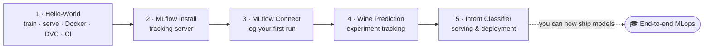
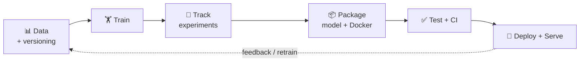

# 🚀 MLops — A Hands-On Learning Curriculum

> **Learn MLops by building, not just reading.** Five small, self-contained projects take you from *"train a model in a script"* all the way to *"a versioned, tracked, containerised model serving live predictions on a server"* — one concept at a time.


This repo is built to be **cloned and followed**. Each module is a tiny, working project that teaches exactly one slice of the MLops stack. Do them in order and you'll have touched every stage of getting a model into production.

---

## 🗺️ The learning journey



---

## 📚 The 5 modules

| # | Module | What you learn | Key tools |
| --- | --- | --- | --- |
| 1 | **[hello-world-mlops](hello-world-mlops/README.md)** | The full mini-loop: train → CLI → API → Docker → data versioning → CI | scikit-learn, Flask, Docker, DVC, Actions |
| 2 | **[mlflow-basic-install](mlflow-basic-install/README.md)** | Stand up an MLflow **tracking server** (backend + artifact store) | MLflow, SQLite |
| 3 | **[mlflow-connect](mlflow-connect/README.md)** | **Log a run** to the server from Python (params, metrics, tags) | MLflow |
| 4 | **[Wine-Prediction-Model](Wine-Prediction-Model/README.md)** | **Experiment tracking** on a real model + hyperparameter sweeps | scikit-learn, MLflow, DVC |
| 5 | **[Intent-classifier-model](Intent-classifier-model/README.md)** | **Serving & deployment**: tests, Docker, CI, Nginx + Gunicorn on a server | Flask, Docker, Actions, Gunicorn, Nginx |

> Each module's README is a standalone, step-by-step lesson with a quick start, a diagram, and exercises. Module 5 also ships with a deeper [guided walkthrough](Intent-classifier-model/docs/LEARNING_PATH.md).

---

## 🧩 What "MLops" means here

MLops is everything *around* the model that makes it reliable and repeatable in production. This curriculum maps onto that lifecycle:



| Lifecycle stage | Where you practice it |
| --- | --- |
| Data versioning | Modules 1 & 4 (DVC) |
| Training | All modules |
| Experiment tracking | Modules 2, 3 & 4 (MLflow) |
| Packaging | Modules 1 & 5 (Docker) |
| Testing & CI | Modules 1 & 5 (pytest, GitHub Actions) |
| Deployment & serving | Modules 1 & 5 (Flask, Gunicorn, Nginx, EC2) |

---

## ⚡ Getting started

```bash
git clone https://github.com/Parsa8304/MLops.git
cd MLops

# Then open Module 1 and follow its README:
cd hello-world-mlops
cat README.md
```

**Prerequisites:** basic Python, a terminal, and Git. Docker is needed for the containerisation parts (Modules 1 & 5); an AWS account is optional (only for the EC2 deployment in Module 5).

> 💡 Each module has its **own** virtualenv and `requirements.txt` — set them up per module rather than globally, so the dependencies stay isolated (a good MLops habit in itself).

---

## 🧭 Suggested path

1. **Module 1** — get comfortable with the train → serve → Docker → CI loop.
2. **Modules 2 → 3** — set up MLflow and log your first run.
3. **Module 4** — apply tracking to a real model and compare hyperparameters.
4. **Module 5** — package, test, and deploy a service the way you would in production.

By the end you'll have hands-on experience with the tools that show up in nearly every MLops job description: **scikit-learn, MLflow, DVC, Docker, GitHub Actions, Flask/Gunicorn, and Nginx.**

---

## 🚀 Where to go next

Once the five modules feel comfortable, extend them:

- **Model registry** — promote MLflow runs to staging/production via the Model Registry.
- **Remote DVC storage** — back DVC with S3/GCS so data is shareable.
- **Container registry + CD** — push images to Docker Hub/ECR in CI and auto-deploy.
- **Kubernetes** — deploy the Intent Classifier to a cluster instead of a single server.
- **Monitoring** — add metrics + data-drift detection to a deployed model.

---

## 📂 Repository layout

```
MLops/
├── hello-world-mlops/        # Module 1 — foundations
├── mlflow-basic-install/     # Module 2 — tracking server
├── mlflow-connect/           # Module 3 — log a run
├── Wine-Prediction-Model/    # Module 4 — experiment tracking
├── Intent-classifier-model/  # Module 5 — serving & deployment
└── README.md                 # you are here
```

---

## 🙏 Credits

A personal MLops learning portfolio by [@Parsa8304](https://github.com/Parsa8304). Modules 4 and 5 are based on teaching examples by [Abhishek Veeramalla](https://github.com/iam-veeramalla), extended here with documentation, diagrams, tests, and fixes.

Licensed under the [MIT License](LICENSE).
