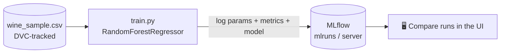

# 🍷 Module 4 — Wine Quality + MLflow Experiment Tracking

> **Tracking on a real model.** A `RandomForestRegressor` predicts wine quality, and every run's parameters, metrics, and the trained model are logged to MLflow — so you can compare hyperparameters scientifically instead of by memory.


📚 Part of the [MLops learning curriculum](../README.md) · **Module 4 of 5**

---

## 🎯 What you'll learn

- Logging **parameters, metrics, and the model artifact** for each run with MLflow.
- Running an experiment **with or without** a tracking server (local `./mlruns` fallback).
- Sweeping **hyperparameters** from the command line and comparing results in the UI.
- Versioning the dataset with **DVC** (`data/wine_sample.csv.dvc`).



---

## ⚡ Quick start

```bash
# 1. Install dependencies
python -m venv venv
source venv/bin/activate            # Windows: venv\Scripts\activate
pip install -r requirements.txt

# 2. Train — logs to a local ./mlruns folder by default (no server needed)
python train.py
# MLflow tracking URI: file:./mlruns
# Logged run <id> | rmse=... r2=...

# 3. Browse the results
mlflow ui            # then open http://127.0.0.1:5000
```

### Log to a tracking server instead

If you started a server in [Module 2](../mlflow-basic-install/README.md):

```bash
MLFLOW_TRACKING_URI=http://localhost:5000 python train.py
```

---

## 🎛️ Sweep hyperparameters

Every knob is a CLI flag, so you can generate many comparable runs:

```bash
python train.py --n-estimators 100 --max-depth 8  --run rf-deep
python train.py --n-estimators 50  --max-depth 3  --run rf-shallow
```

Open the MLflow UI, select both runs, and compare `rmse` / `r2` side by side. **That** is experiment tracking earning its keep.

| Flag | Default | Meaning |
| --- | --- | --- |
| `--csv` | `data/wine_sample.csv` | Path to the dataset |
| `--target` | `quality` | Target column |
| `--n-estimators` | `50` | Number of trees |
| `--max-depth` | `5` | Max tree depth |
| `--test-size` | `0.2` | Test split fraction |
| `--experiment` | `wine-prediction` | MLflow experiment name |
| `--run` | `run-2` | MLflow run name |

---

## 🗂️ The data (DVC)

The dataset is tracked by **DVC**, not committed directly to git — `data/wine_sample.csv.dvc` is the pointer. Fetch the real file with `dvc pull` if you have a configured remote, or drop a `wine_sample.csv` with a `quality` column into `data/`.

`utils.py` provides small helpers (`load_data`, `features_and_target`) that validate the `quality` column is present.

---

➡️ **Next module:** [Intent-classifier-model](../Intent-classifier-model/README.md) — packaging and deploying a model to a real server.
