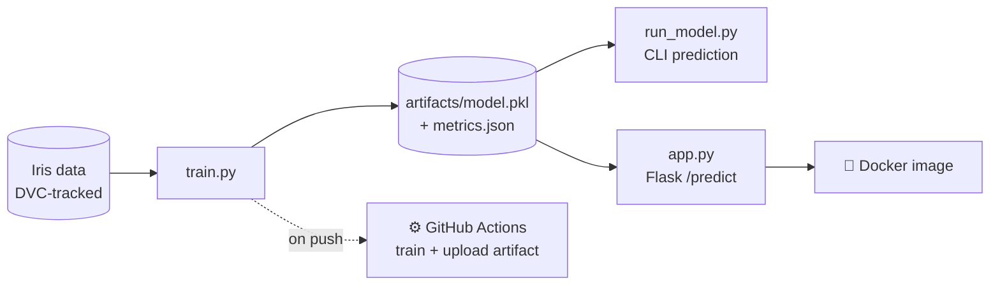

# 👋 Module 1 — Hello-World MLops

> **The foundations.** Train a model, run it from the CLI, serve it over HTTP, containerise it, version the data with DVC, and automate it all with CI — the smallest possible end-to-end MLops loop.


📚 Part of the [MLops learning curriculum](../README.md) · **Module 1 of 5**

---

## 🎯 What you'll learn

| Concept | File |
| --- | --- |
| Train & save a model + metrics | `train.py` → `artifacts/model.pkl`, `artifacts/metrics.json` |
| Run inference from the **command line** | `run_model.py` |
| Serve the model as an **HTTP API** | `app.py` |
| **Containerise** the service | `Dockerfile`, `docker-compose.yml` |
| **Version data** separately from code | DVC (`data.dvc`, `.dvc/`) |
| **Automate** train + artifact upload | `.github/workflows/` (GitHub Actions) |

The model is a `LogisticRegression` on the classic **Iris** dataset. As always in this curriculum, the model is trivial on purpose — the surrounding MLops workflow is the lesson.

---

## 🔄 The flow



---

## ⚡ Quick start

```bash
# 1. Create a virtualenv and install deps
python -m venv .venv
source .venv/bin/activate          # Windows: .venv\Scripts\activate
pip install --upgrade pip
pip install -r requirements.txt

# 2. Train the model (writes artifacts/model.pkl + metrics.json)
python train.py
#   Saved model to artifacts/model.pkl
#   Test accuracy: 1.0000

# 3a. Predict from the CLI
python run_model.py --input "[5.1, 3.5, 1.4, 0.2]"
#   {"prediction": [0]}

# 3b. ...or serve it as an API
python app.py                      # http://127.0.0.1:5001
```

Test the API (in another terminal):

```bash
curl -X POST http://127.0.0.1:5001/predict \
  -H "Content-Type: application/json" \
  -d '{"features":[5.1,3.5,1.4,0.2]}'
# {"prediction": 0}
```

> 💡 `app.py` auto-trains the model on startup if `artifacts/model.pkl` is missing, so the API always comes up.

---

## 🐳 Run with Docker

```bash
docker build -t hello-mlops .
docker run --rm -p 5001:5001 hello-mlops
```

Or with Docker Compose (maps host **5002** → container **5001**, mounts the code for live reload):

```bash
docker compose up --build
curl -X POST http://127.0.0.1:5002/predict -H "Content-Type: application/json" -d '{"features":[6.2,3.4,5.4,2.3]}'
```

---

## 🗂️ Data versioning with DVC

Git is great for code but terrible for data. **DVC** versions large data/artifacts alongside git, keeping the heavy files out of the repo.

```bash
dvc status            # see what changed
dvc repro             # reproduce tracked stages (if a pipeline is defined)
dvc pull              # fetch the actual data for the tracked pointers
```

The `data.dvc` file is a tiny pointer git tracks; the real data lives in DVC's cache/remote. That's the whole idea — **code in git, data in DVC.**

---

## ⚙️ Continuous Integration

`.github/workflows/` trains the model on every push to `main` and uploads the resulting artifacts, so each commit produces a verifiable, downloadable model.

---

## 🔌 API reference

| Method | Path | Body | Response |
| --- | --- | --- | --- |
| `GET` | `/health` | — | `{"status": "ok"}` |
| `POST` | `/predict` | `{"features": [f1, f2, f3, f4]}` | `{"prediction": <class>}` |

A missing `features` key returns HTTP `400`.

---

➡️ **Next module:** [mlflow-basic-install](../mlflow-basic-install/README.md) — stand up an MLflow tracking server so your experiments are recorded.
