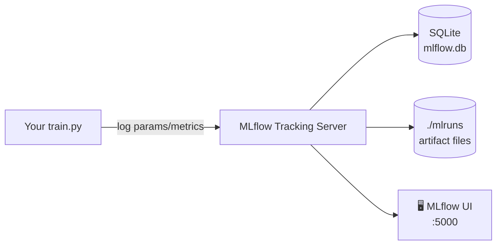

# 📊 Module 2 — MLflow: Install & Run a Tracking Server

> **Experiment tracking starts here.** Once you train more than one model you need to *remember* what you tried. MLflow records every run's parameters, metrics, and artifacts — and gives you a UI to compare them.


📚 Part of the [MLops learning curriculum](../README.md) · **Module 2 of 5**

---

## 🎯 What you'll learn

- What an MLflow **tracking server** is and why you need one.
- The difference between the **backend store** (params/metrics → SQLite here) and the **artifact store** (files → local folder here).
- How to start the server and open the **MLflow UI**.



---

## ⚡ Quick start

```bash
# 1. Create a virtualenv and install MLflow
python -m venv venv
source venv/bin/activate            # Windows: venv\Scripts\activate
pip install -r requirements.txt

# 2. Start the tracking server
#    - backend store (params/metrics) -> SQLite file mlflow.db
#    - artifact store (files)         -> ./mlartifacts
mlflow server \
  --backend-store-uri sqlite:///mlflow.db \
  --default-artifact-root ./mlartifacts \
  --host 0.0.0.0 --port 5000
```

Open the UI at **http://127.0.0.1:5000** — empty for now, until a script logs a run.

---

## 🧠 Backend store vs artifact store

| | Stores | Example here |
| --- | --- | --- |
| **Backend store** | Run metadata: params, metrics, tags | `sqlite:///mlflow.db` |
| **Artifact store** | Files: models, plots, datasets | `./mlartifacts` |

In production you'd point these at a real database (PostgreSQL) and object storage (S3) — but the *concept* is identical.

---

## 🧪 Exercise

1. Start the server with the command above.
2. Leave it running and open the next module.
3. After running a training script that logs to this server, refresh the UI and watch the run appear.

---

➡️ **Next module:** [mlflow-connect](../mlflow-connect/README.md) — point a Python script at this server.
