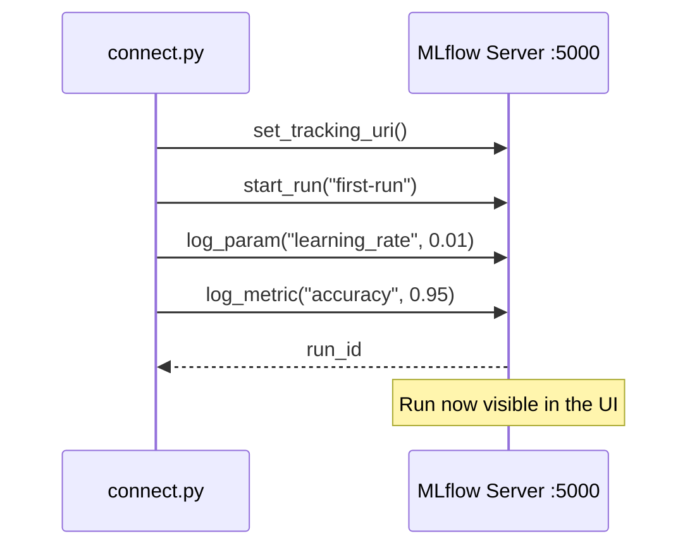

# 🔌 Module 3 — Connect to MLflow & Log a Run

> **Make the UI light up.** With a tracking server running (Module 2), this module sends your first experiment to it from a Python script — params, a metric, and a tag.


📚 Part of the [MLops learning curriculum](../README.md) · **Module 3 of 5**

---

## 🎯 What you'll learn

- How a script **connects** to a tracking server (`set_tracking_uri`).
- The anatomy of a **run**: `start_run()` → `log_param` / `log_metric` / `set_tag`.
- How runs appear and compare in the MLflow UI.



---

## ⚡ Quick start

```bash
# Make sure a tracking server is running (see ../mlflow-basic-install):
#   mlflow server --backend-store-uri sqlite:///mlflow.db --port 5000

pip install mlflow

# Log a run to the server
python connect.py
# Connecting to MLflow at http://localhost:5000
# Logged run <id> — refresh the MLflow UI to see it.
```

Point at a different server without editing code:

```bash
MLFLOW_TRACKING_URI=http://localhost:7006 python connect.py
```

Now open **http://127.0.0.1:5000**, click the `hello-mlflow` experiment, and you'll see `first-run` with its parameter, metric, and tag.

---

## 🧪 Exercise

- Run `connect.py` a few times with different `log_param`/`log_metric` values and compare the runs side by side in the UI.

---

➡️ **Next module:** [Wine-Prediction-Model](../Wine-Prediction-Model/README.md) — a real training script that logs to MLflow.
